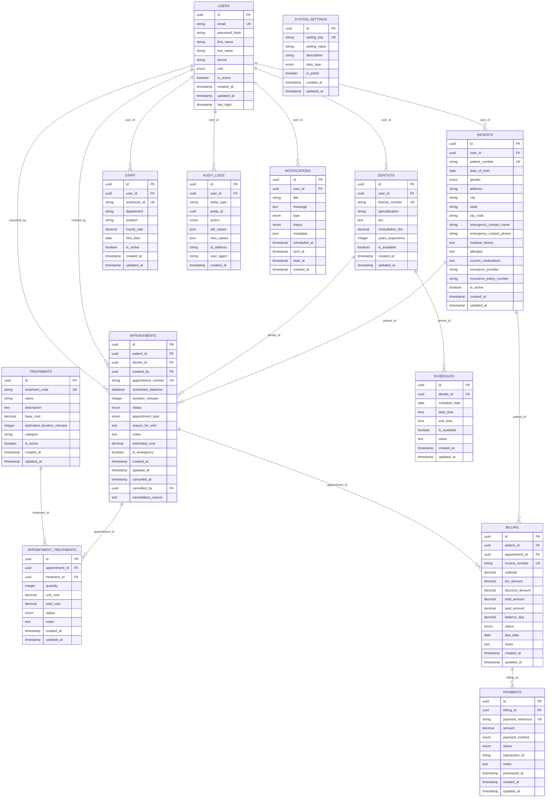

# Entity Relationship Diagrams (ERD)
## SwiftCare Dental Clinic MVP

### Complete Data Model



### Entity Definitions

#### USERS
Core user authentication and profile information for all system users.

**Key Attributes:**
- `role`: ENUM('patient', 'dentist', 'receptionist', 'admin', 'manager')
- `email`: Unique identifier for login
- `is_active`: Soft delete flag

#### PATIENTS
Extended profile information specific to patients.

**Key Attributes:**
- `patient_number`: Auto-generated unique identifier (P-YYYY-NNNN)
- `medical_history`: JSON or text field for medical conditions
- `insurance_policy_number`: For billing integration

#### DENTISTS
Professional information for dental practitioners.

**Key Attributes:**
- `license_number`: State dental license number
- `specialization`: Area of expertise
- `consultation_fee`: Base consultation rate

#### APPOINTMENTS
Central scheduling entity with comprehensive status tracking.

**Key Attributes:**
- `status`: ENUM('scheduled', 'confirmed', 'in_progress', 'completed', 'cancelled', 'no_show')
- `appointment_type`: ENUM('consultation', 'cleaning', 'procedure', 'emergency', 'follow_up')
- `duration_minutes`: Default 30, customizable per appointment type

#### TREATMENTS
Master catalog of dental procedures and services.

**Key Attributes:**
- `treatment_code`: Standardized dental procedure codes (ADA codes)
- `category`: Grouping for reporting (preventive, restorative, surgical, etc.)

#### BILLING
Comprehensive billing system with multi-payment support.

**Key Attributes:**
- `status`: ENUM('draft', 'sent', 'paid', 'overdue', 'cancelled')
- `balance_due`: Calculated field (total_amount - paid_amount)

### Database Constraints and Indexes

#### Primary Indexes
- All primary keys (UUID) have clustered indexes
- Unique constraints on business keys (email, patient_number, etc.)

#### Performance Indexes
```sql
-- Appointment queries
CREATE INDEX idx_appointments_patient_date ON appointments(patient_id, scheduled_datetime);
CREATE INDEX idx_appointments_dentist_date ON appointments(dentist_id, scheduled_datetime);
CREATE INDEX idx_appointments_status ON appointments(status);

-- Billing queries
CREATE INDEX idx_billing_patient_status ON billing(patient_id, status);
CREATE INDEX idx_billing_due_date ON billing(due_date) WHERE status != 'paid';

-- Audit trail
CREATE INDEX idx_audit_logs_entity ON audit_logs(entity_type, entity_id);
CREATE INDEX idx_audit_logs_user_date ON audit_logs(user_id, created_at);

-- User lookups
CREATE INDEX idx_users_email ON users(email);
CREATE INDEX idx_users_role_active ON users(role, is_active);
```

#### Foreign Key Constraints
All foreign key relationships enforce referential integrity with appropriate CASCADE/RESTRICT rules:
- User deletions: RESTRICT (prevent deletion if related records exist)
- Appointment cancellations: SET NULL for cancelled_by
- Soft deletes: Use is_active flags instead of hard deletes
